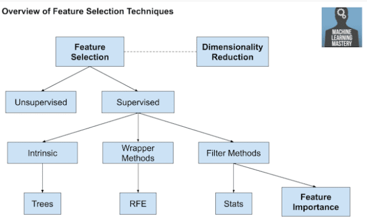

Feature Selection
=================

Feature selection refers to techniques for selecting a subset of input features that are most relevant to the target variable that is being predicted.

This is important as irrelevant and redundant input variables can distract or mislead learning algorithms possibly resulting in lower predictive performance. Additionally, it is desirable to develop models only using the data that is required to make a prediction, e.g. to favor the simplest possible well performing model.

Feature selection techniques are generally grouped into those that use the target variable (supervised) and those that do not (unsupervised). Additionally, the supervised techniques can be further divided into models that automatically select features as part of fitting the model (intrinsic), those that explicitly choose features that result in the best performing model (wrapper) and those that score each input feature and allow a subset to be selected (filter).

Statistical methods are popular for scoring input features, such as correlation. The features can then be ranked by their scores and a subset with the largest scores used as input to a model. The choice of statistical measure depends on the data types of the input variables and a review of different statistical measures that can be used.

Additionally, there are different common feature selection use cases we may encounter in a predictive modeling project, such as:

* Categorical inputs for a classification target variable.
* Numerical inputs for a classification target variable.
* Numerical inputs for a regression target variable.
* When a mixture of input variable data types a present, different filter methods can be used. Alternately, a wrapper method such as the popular RFE method can be used that is agnostic to the input variable type.

The broader field of scoring the relative importance of input features is referred to as feature importance and many model-based techniques exist whose outputs can be used to aide in interpreting the model, interpreting the dataset, or in selecting features for modeling.
